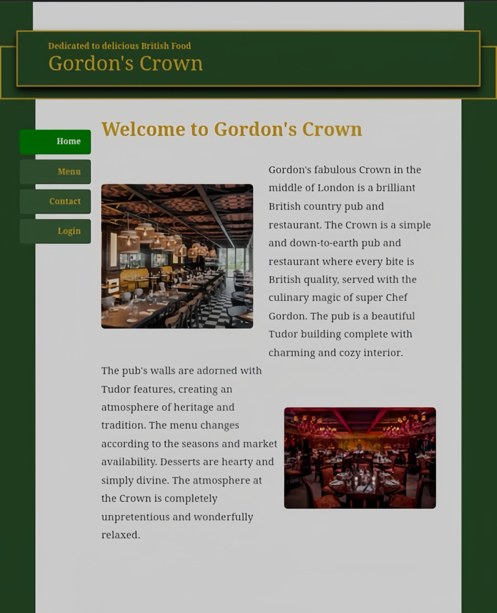

# 🌟 Restaurant Website - Gordon's Crown 🌟

Welcome to **Gordon's Crown**, a beautifully designed website showcasing our restaurant's offerings, including appetizers, soups, and local dishes. Built with **PHP** and **CSS**, this project provides a complete overview of the restaurant's menu and features a voting system for customer feedback.

---

## 📸 Screenshots


*Screenshot of the main homepage with the restaurant's menu and voting features.*

---

## 🧩 Features

- **Dynamic Menu Display**: Shows appetizers, soups, and local dishes in a structured layout.
- **Customer Voting System**: Allows customers to vote on their favorite dishes.
- **Responsive Design**: Ensures a seamless experience across devices.

---

## 🚀 Getting Started

To get started with this project, follow the steps below:

### Prerequisites

- **PHP** installed on your server.
- **CSS** and **HTML** knowledge for customization (if needed).

### Installation

1. Clone the repository:
   ```bash
   git clone https://github.com/Heliophile0208/Simple_restaurant
